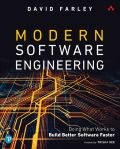

# Review - Modern Software Engineering

Henrik Samuelsson, 2022 January 01

## Book Information

Title: Modern Software Engineering, Doing What Works to Build Better Software Faster  
Author: David Farley  

Publisher: Addison-Wesley Professional, 2021 December 10  

ISBN-13: 978-0-13-731491-1  
ISBN-10: 0-13-731491-4  

Pages: 256

Tags: software engineering, continuous integration, test-driven development

Level: Intermediate

## Description

David Farley have a background as a software engineer and have made contributions in the field of continuous integration. He shares his expertize through various media such as Youtube, books, and by providing training courses.

